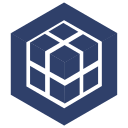

# Hi I´m Germán! 👋

[][linkedin]
[][gmail]
 

## Full stack web developer, tech lead, blockcain enthusiast, math teacher and a sophophilic (i love learning)

 
#
- 👀 I’m interested in new technologies, music, sports, books
- 💞️ I’m looking to collaborate on blockchain proyects

## Stack and Tools

[linkedin]: https://www.linkedin.com/in/germansuarezdev/
[gmail]: mailto:ger.antonyk@gmail.com
<!---
gerantonyk/gerantonyk is a ✨ special ✨ repository because its `README.md` (this file) appears on your GitHub profile.
You can click the Preview link to take a look at your changes.
--->
