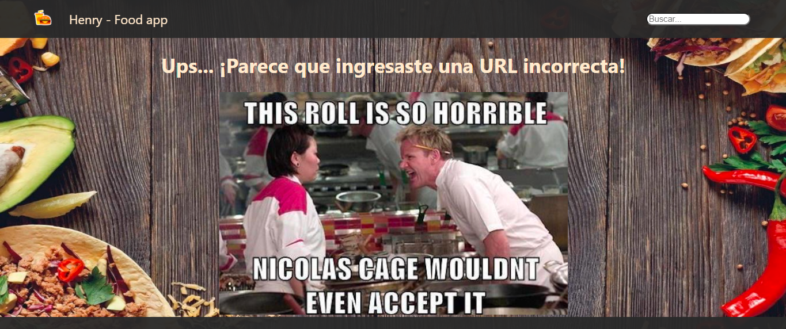

# Hi I´m Germán! 👋

[][linkedin]
[][gmail]
 

## I'm a full stack web developer, tech lead, blockcain enthusiast, math teacher and a sophophilic (I love learning)

 

I've been working as a tech/project leader for the past 8 years. Last year, I decided to upgrade my stack, so I started henry's bootcamp. Currently, I'm doing projects with JavaScript and Node, but I've been taking solidity and blockchain courses also.

I'm hoping to colaborate in blockchain projects.

We got third place on Didi's hackathon with our project Civica:
   

  [][civica]

   

## My current stack and tools

  
  
  
  
  
  
  
  
  
  
  
  

 
 
 

## :pushpin: My proyects

<h3>Food App</h3>

SPA (single page application). I developed the frontend with React and Redux. For the styles i used vainilla css. I used node.js for the backend, with express and sequelize for models with a DB on Postgresql. The app consumes data from an external API.

  
  
  

 

&nbsp;

<h3>Wipit board</h3>

A pair programming platform for developers to help each other. We used react and redux for the frontend. For the styles we used Chacka. We used node.js for the backend, with express and sequelize for models with a DB on Postgresql. We also developed an internal chat with socket.io.

  
  &nbsp;
  

 

[linkedin]: https://www.linkedin.com/in/germansuarezdev/
[gmail]: mailto:ger.antonyk@gmail.com
[civica]:https://youtu.be/d8FiO89dwkc
<!---
gerantonyk/gerantonyk is a ✨ special ✨ repository because its `README.md` (this file) appears on your GitHub profile.
You can click the Preview link to take a look at your changes.
--->
